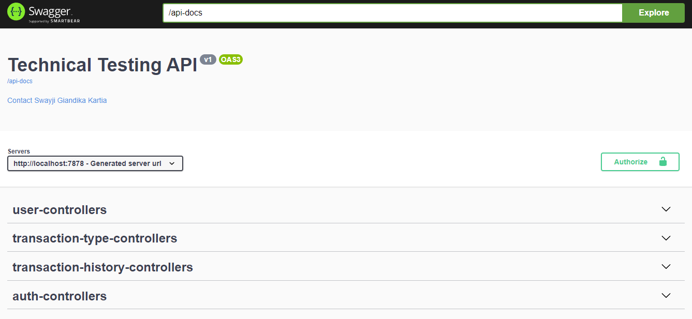
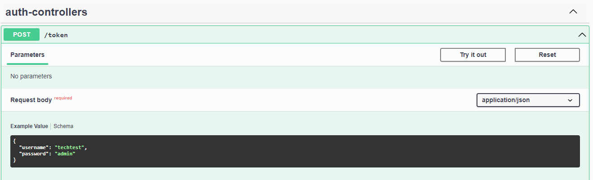
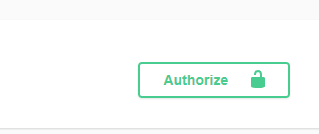
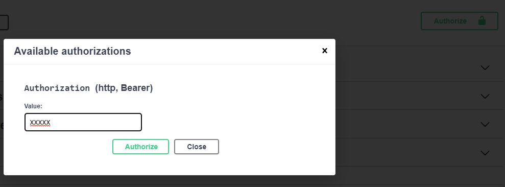
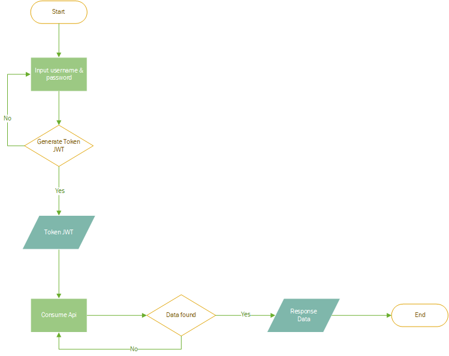
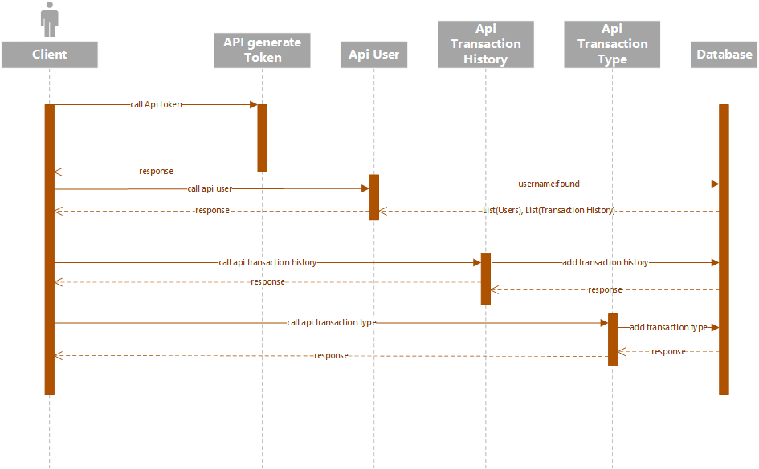

Ketika project di jalankan, dapat melihat api-docs yg terdapat di url: http://:baseUrl}/swagger-ui.html
berikut tampilannya:

Sebelum menggunakan API yang ada, di haruskan men-generate token JWT di API berikut:

Kemudian masukan token dengan menekan kunci di pojok kanan:

Setelah itu dapat menggunakan API yang lainnya.

# Flowchart

# Sequence Diagram
